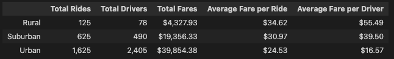
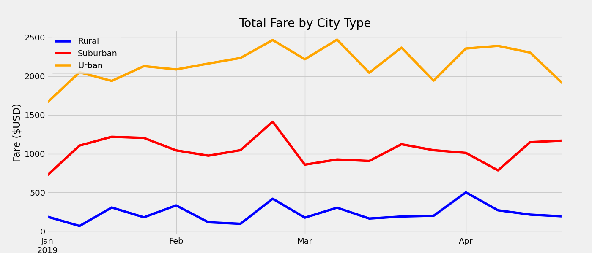

# PyBer_Analysis

## Overview of the analysis

The purpose of this new analysis was to analyze PyBer data to uncover trends to support decision-makers at PyBer. More specifically, this particular analysis was undertaken to address disparities between city types (urban, rural and suburban) in terms of driver number, total rides and total fares generated.The end goal was to determine if there were any differences in these values, which could then be used to make informed decisions to allocate resources most effectively. 

## Results

As can be seen in the following image, the different city types have different values for each column. There are many more drivers in urban vs. rural areas and consequently more rides, too. The average fare per ride and average fare per driver, however, is higher in rural areas compared to urban areas. Suburban areas always lie inbetween rural and urban. In terms of total fares, there is almost 10x more in urban areas than rural areas.  

The line graph below depicts data for each city type over a period of 4 months with each data point representing a weeks worth of total fares. It is apparent that in urban areas the total fares generated are much higher than rural areas with suburban areas, again, landing somewhere inbetween. 

Additionally, there seems to be a bit of an increase in terms of fare per week in the urban and suburban city types during the summer months and then a dip in the colder, winter months. 

## Summary

After analyzing / visualizing the data, here are my 3 business recommendations to address disparities among city types: 

1) Increase the amount of total drivers in rural areas as it seems to be unsaturated and could increase total rides and thus total fares.

2) Decrease the amount of total drivers in urban areas as it seems to be saturated as the average fare per driver is really low. 

3) Conduct a further analysis into the length of a ride - we only have data on total rides, but if a ride in a rural area is 1 hour and the fare is $34.62 and a ride in an urban area is 30 minutes and the fare is $24.53, then a driver can complete 2 rides in an urban area with greater profit than can one driver in a rural area. 

